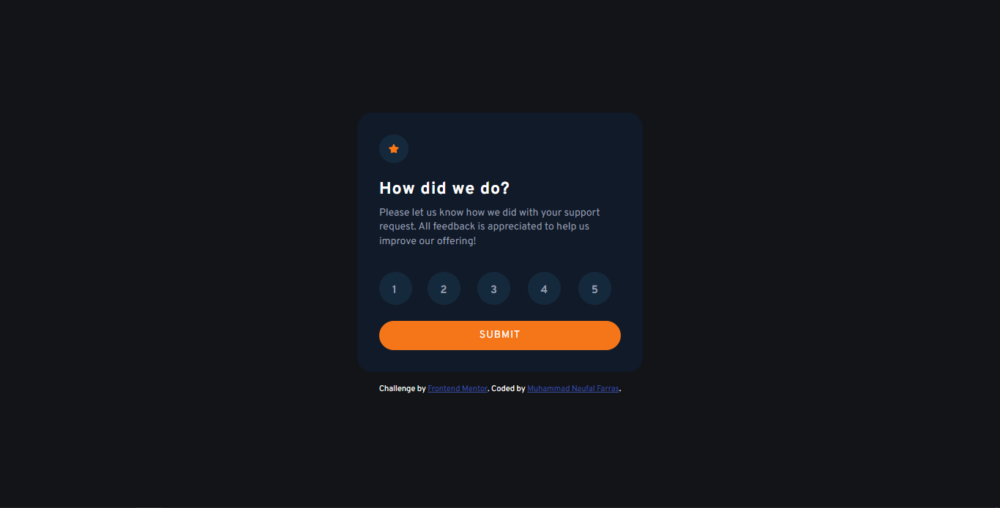

# Frontend Mentor - Interactive rating component solution

This is a solution to the [Interactive rating component challenge on Frontend Mentor](https://www.frontendmentor.io/challenges/interactive-rating-component-koxpeBUmI). Frontend Mentor challenges help you improve your coding skills by building realistic projects. 

## Table of contents

- [Overview](#overview)
  - [The challenge](#the-challenge)
  - [Screenshot](#screenshot)
  - [Links](#links)
- [My process](#my-process)
  - [Built with](#built-with)
- [Author](#author)
- [Acknowledgments](#acknowledgments)

**Note: Delete this note and update the table of contents based on what sections you keep.**

## Overview

### The challenge

Users should be able to:

- View the optimal layout for the app depending on their device's screen size
- See hover states for all interactive elements on the page
- Select and submit a number rating
- See the "Thank you" card state after submitting a rating

### Screenshot

### Links

- Solution URL: [Click Here](https://github.com/naufalf25/Interactive-Rating-Component)
- Live Site URL: [Click Here](https://naufalf25.github.io/Interactive-Rating-Component/)

## My process

### Built with

- HTML5
- CSS3
- Javascript

### Useful resources

- [Stack Overflow](https://stackoverflow.com/) - This helped me for solving my problem to finishing this project.

## Author

- Frontend Mentor - [@naufalf25](https://www.frontendmentor.io/profile/naufalf25)
- Instagram - [@naufal_railfans25](https://www.instagram.com/naufal_railfans25/)
- Linkedin - [Muhammad-Naufal-Farras](https://www.linkedin.com/in/muhammad-naufal-farras-2605a2200/)
